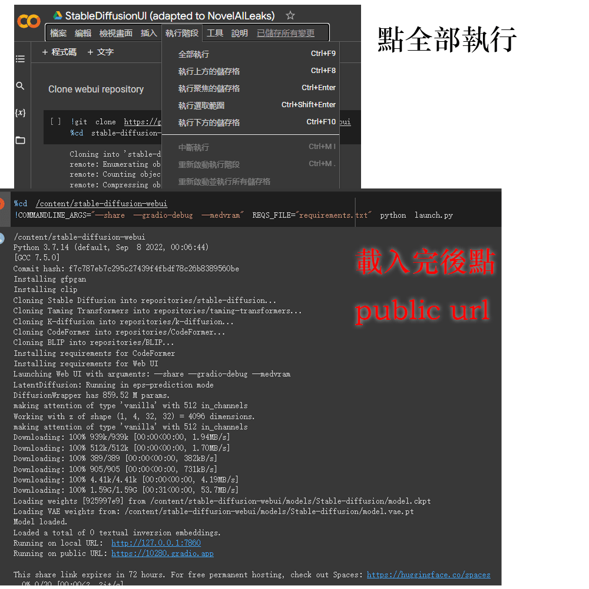

English | [繁體中文](README_TCH.md)
# Recommend : [4Chan ver](4chan_ver)
You can use this version to experience how novelai official works.
## [4chan local low vram fixed](https://github.com/null-base/NAIFU-4chan-lowvram-ver)
You can use less vram(less than 8g) to use 4chan ver novelai at local.

# Update
* updated 4chan ver colab based on [src](https://boards.4channel.org/g/thread/89095460#p89097704). You can get [here](4chan_ver).

# novelai 4chan ver tutorial
You can see [tutorial](https://www.youtube.com/watch?v=6twkdI9i3-c) on [youtube](https://www.youtube.com/watch?v=6twkdI9i3-c) by clicking img below

# Genre
* [Webui](webui-ver)
* [4Chan](4chan_ver)

[Google Colab](https://colab.research.google.com/)

# novelai webui ver tutorial
You can see [tutorial](https://www.youtube.com/watch?v=yPnEWe94xIw) on [youtube](https://www.youtube.com/watch?v=yPnEWe94xIw) by clicking img below

## How to use
* First, you need a google account
* secont, open this [colab](https://colab.research.google.com/)
* third, import [4chan ver ipynb](4chan_ver) or [webui ver ipynb](webui-ver).
* final, Runtime->Run all->Wait->Open the output public url.
---

