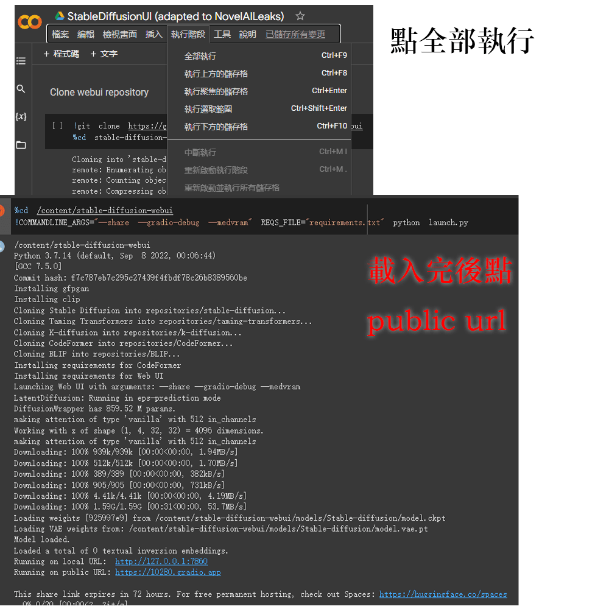

[English](README.md) | 繁體中文 |
# Recommend推薦 : [4 Chan 版](4chan_ver)
這個版本更接近於官方的服務以及功能更為先進，但要消耗更高性能，所以更推薦在colab上使用。
## [4chan 本地低顯存優化](https://github.com/null-base/NAIFU-4chan-lowvram-ver)
你可以使用更少的顯存(低於8g)來使用最新版的4chan novelai。

# Update更新
* 更新 4chan 版 colab 根據 [4chan的討論串](https://boards.4channel.org/g/thread/89095460#p89097704) 製作。 你可以在 [這](4chan_ver) 獲得。

# novelai 4chan 版本教學
可以透過下方圖片在 [youtube](https://www.youtube.com/watch?v=6twkdI9i3-c) 看到我的[教學](https://www.youtube.com/watch?v=6twkdI9i3-c)。

# Genre類別
* [Webui](webui-ver)
* [4Chan](4chan_ver)

[Google Colab](https://colab.research.google.com/)

# novelai webui 版本教學
可以透過下方圖片在 [youtube](https://www.youtube.com/watch?v=yPnEWe94xIw) 看到我的[教學](https://www.youtube.com/watch?v=yPnEWe94xIw)。

## 使用教學
* 第一步你需要一個 google 帳號
* 第二步你需要打開 [colab](https://colab.research.google.com/)
* 第三步導入這個[ipynb](StableDiffusionUI_(adapted_to_NovelAILeaks).ipynb)檔
* 最後照下圖做
---

